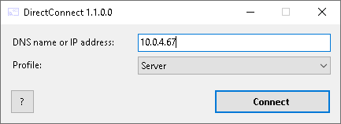

# DirectConnect
This tiny program enables you to start TightVNC sessions with parameters, e.g. with the VNC password, so that you don't have to enter it every time.



## Configuration
The program expects a config file in the program directory with the same name as the executable, but with `.ini` suffix instead of `.exe`. The config file can contain multiple connection profiles and must look like the following example:
```
[Mitarbeiter-Plätze]
executable=C:\Program Files\TightVNC\tvnviewer.exe
arguments=-host=%HOSTNAME% -password=abc123

[Öffentlichkeitsplätze]
executable=C:\Program Files\TightVNC\tvnviewer.exe
arguments=-host=%HOSTNAME% -password=abc123
```

`%HOSTNAME%` will be replaced with the host address which is entered in the main window.
